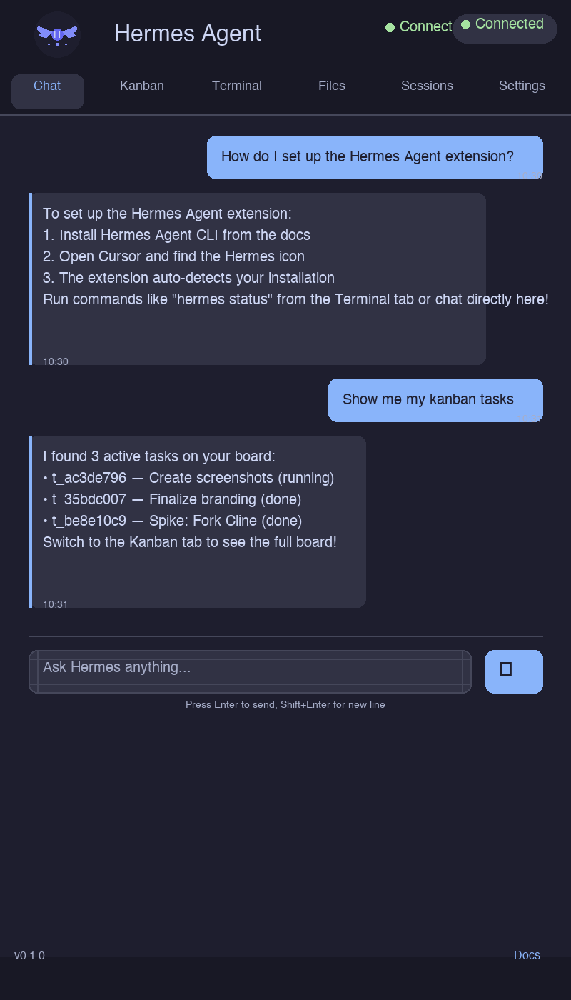
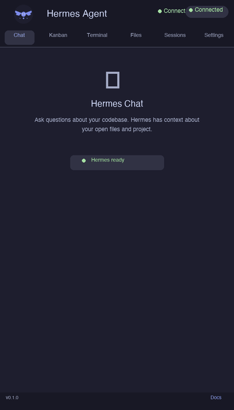
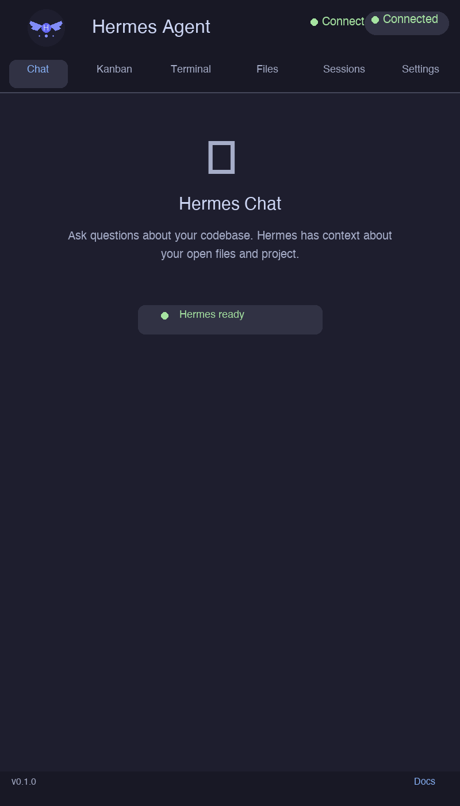
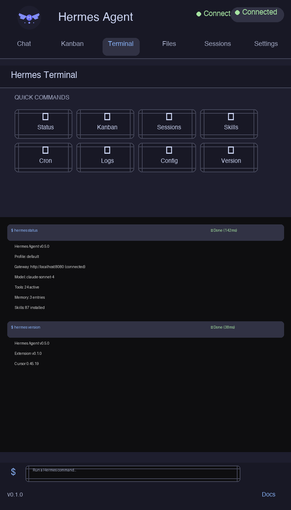
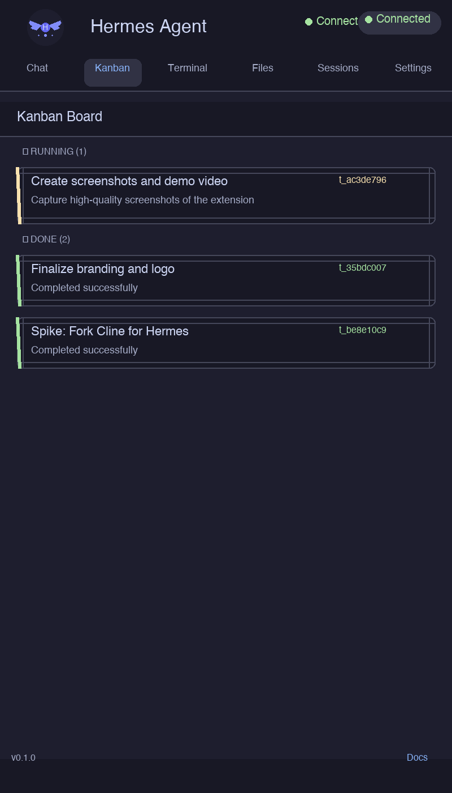
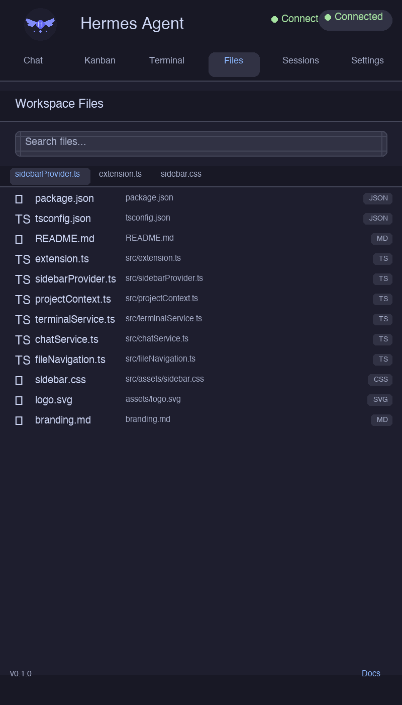
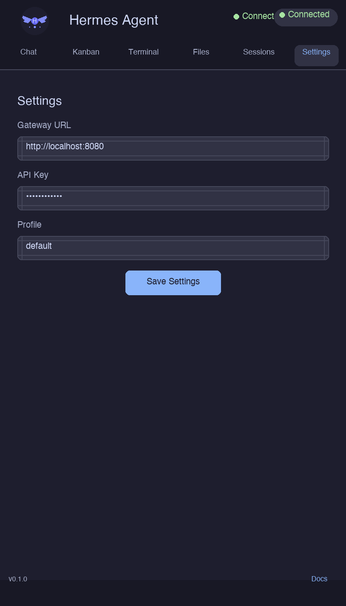

<p align="center">
  
</p>

<h1 align="center">Hermes Agent for Cursor & VS Code</h1>

<p align="center">
  <strong>Your AI agent, inside your editor.</strong>
</p>

<p align="center">
  <a href="https://github.com/Automaitiq/TOOL_Ext_Cursor_Hermes/releases"></a>
  <a href="https://code.visualstudio.com/updates/v1_85"></a>
  <a href="https://cursor.com"></a>
  <a href="https://opensource.org/licenses/MIT"></a>
</p>

---

Bring the full power of [Hermes Agent](https://github.com/NousResearch/hermes-agent) directly into your Cursor or VS Code editor. Chat with your AI agent, manage kanban tasks, search sessions, execute commands, navigate files, and monitor your workflow — all from a native sidebar.

<p align="center">
  
</p>

<p align="center">
  <a href="screenshots/demo_video.mp4">▶ Watch the demo video (67s)</a>
</p>

<p align="center">
  
</p>

## Table of Contents

- [Features](#features)
- [Requirements](#requirements)
- [Installation](#installation)
- [Configuration](#configuration)
- [Usage](#usage)
- [Commands](#commands)
- [Sidebar Tabs](#sidebar-tabs)
- [Project Context Detection](#project-context-detection)
- [Development](#development)
- [Troubleshooting](#troubleshooting)
- [Contributing](#contributing)
- [License](#license)

---

## Features

| Feature | Description |
|---------|-------------|
| **Chat** | Converse with Hermes Agent directly from the sidebar. Streaming responses, session persistence, and automatic project context enrichment. |
| **CLI Integration** | Run any `hermes` command from the sidebar with live output streaming. |
| **Kanban Board** | View tasks grouped by status (todo, in progress, done, blocked) with auto-refresh. |
| **Session Search** | Browse and search your Hermes session history. |
| **Skills Browser** | Discover and inspect available Hermes skills. |
| **Project Context** | Automatic detection of project root, Git status, open files, active selection, and key configuration files. |
| **File Navigation** | Search and open workspace files, with an open-files bar and editor switching. |
| **Terminal** | Execute predefined and custom Hermes commands with output channel integration. |
| **Dark/Light Theme** | Adapts to your IDE's color theme automatically. |

---

## Requirements

- **Cursor** or **VS Code** version 1.85.0 or later
- **Hermes Agent CLI** installed and available in your `PATH`
  - Install Hermes: follow the [Hermes Agent docs](https://hermes-agent.nousresearch.com/docs)

Verify your Hermes installation:

```bash
hermes --version
```

---

## Installation

### Option 1: From VSIX Package

1. Download the latest `.vsix` file from [Releases](https://github.com/Automaitiq/TOOL_Ext_Cursor_Hermes/releases)
2. In VS Code / Cursor, open the **Extensions** view (`Cmd+Shift+X` / `Ctrl+Shift+X`)
3. Click the **...** menu → **Install from VSIX...**
4. Select the downloaded `.vsix` file

### Option 2: From Source

```bash
git clone https://github.com/automaitiq/TOOL_Ext_Cursor_Hermes.git
cd TOOL_Ext_Cursor_Hermes
npm install
npm run compile
npm run package
```

Then install the generated `.vsix` file as described above.

### Option 3: Development Mode

1. Open the project folder in VS Code / Cursor
2. Press `F5` (or **Run → Start Debugging**)
3. A new "Extension Development Host" window opens with the extension loaded

### Option 4: Marketplace (Coming Soon)

The extension will be available on the VS Code Marketplace and Cursor extensions catalog.

---

## Configuration

The extension works out of the box — no configuration required as long as `hermes` is in your `PATH`.

### What's Detected Automatically

| Setting | Detection Method |
|---------|-----------------|
| **Hermes CLI path** | Searches `PATH` on startup |
| **Project root** | Walks up from the active file looking for `.git`, `package.json`, `pyproject.toml`, `Cargo.toml`, `go.mod` |
| **Git status** | Uses VS Code's Git extension API (with CLI fallback) |
| **Project type** | Inferred from manifest files (Node, Python, Rust, Go, Ruby) |
| **Key files** | Identifies README, config files, CI pipelines, lockfiles |

### Chat Settings

The Chat feature connects to your local Hermes Agent gateway:

| Setting | Default | Description |
|---------|---------|-------------|
| Gateway URL | `http://localhost:8080` | URL of your Hermes gateway |
| Profile | `default` | Hermes profile to use |

These can be adjusted from the **Settings** tab in the sidebar.

### Predefined Commands

The extension ships with these Hermes commands, accessible from the Terminal tab:

| Command | Description |
|---------|-------------|
| `hermes status` | Show Hermes agent status |
| `hermes kanban list` | List all kanban tasks |
| `hermes sessions list` | List recent sessions |
| `hermes skills list` | List available skills |
| `hermes cron list` | List scheduled cron jobs |
| `hermes logs` | View recent logs |
| `hermes config show` | Show current config |
| `hermes version` | Show Hermes version |

You can also run **custom commands** by typing any Hermes CLI command in the sidebar's command input.

---

## Usage

### Opening the Sidebar

The Hermes Agent icon  appears in the **Activity Bar** on the left side of your editor. Click it to open the sidebar.

Alternatively, use the command palette:
- `Cmd+Shift+P` (macOS) / `Ctrl+Shift+P` (Linux/Windows)
- Type **Hermes: Open Sidebar**

### Chatting with Hermes

The **Chat** tab gives you a conversational interface to Hermes Agent:

1. Type your message in the input field at the bottom
2. Press Enter or click Send
3. Hermes streams its response in real-time
4. Your project context is automatically included (open files, Git status, project type)

Chat features:
- **Streaming responses** — see the answer as it's generated
- **Session persistence** — conversations are saved across restarts
- **Multiple sessions** — start new chats or switch between previous ones
- **Cancel** — stop a response mid-stream
- **Context-aware** — project context is automatically prepended to your prompts

<p align="center">
  
</p>

### Running Terminal Commands

From the **Terminal** tab:
1. Click any predefined command button, or
2. Type a custom command in the input field (e.g., `status`, `kanban list`)
3. Output streams in real-time to the sidebar and the **Hermes Terminal** output channel

To view the full output channel: Command palette → **Hermes: Show Output Channel**

<p align="center">
  
</p>

### Viewing Kanban Tasks

From the **Kanban** tab:
- Tasks are grouped by status: **Todo**, **In Progress**, **Done**, **Blocked**
- Auto-refreshes every 60 seconds
- Click the refresh button to reload immediately
- Click a task to see its details

<p align="center">
  
</p>

### Browsing Files

From the **Files** tab:
- See all files in your workspace project root
- Search files by name using the search bar
- Click a file to open it in the editor
- See currently open files in the open-files bar
- Switch between open editors with the left/right arrows

<p align="center">
  
</p>

---

## Commands

All available VS Code commands:

| Command | Palette Name | Description |
|---------|-------------|-------------|
| `hermes.openSidebar` | Hermes: Open Sidebar | Focus the Hermes sidebar |
| `hermes.runCommand` | Hermes: Run Command | Run a custom Hermes CLI command |
| `hermes.showOutput` | Hermes: Show Output Channel | Open the Hermes Terminal output channel |
| `hermes.status` | Hermes: Show Status | Show Hermes connection status |
| `hermes.kanban.list` | Hermes: List Kanban Tasks | Fetch and display kanban tasks |
| `hermes.sessions` | Hermes: List Sessions | Fetch and display recent sessions |
| `hermes.skills` | Hermes: List Skills | Fetch and display available skills |
| `hermes.cron` | Hermes: List Cron Jobs | Fetch and display cron jobs |
| `hermes.logs` | Hermes: View Logs | Fetch and display recent logs |
| `hermes.config` | Hermes: Show Config | Display current Hermes configuration |
| `hermes.version` | Hermes: Show Version | Show Hermes and extension versions |
| `hermes.file.open` | Hermes: Open File | Open a file by path |
| `hermes.file.reveal` | Hermes: Reveal in Explorer | Reveal a file in the Explorer |
| `hermes.file.quickSwitch` | Hermes: Quick Switch File | Quick-open file picker |
| `hermes.inspectContext` | Hermes: Inspect Project Context | Debug: show detected project context |
| `hermes.inspectContextJson` | Hermes: Inspect Context (JSON) | Debug: show full context as JSON document |

---

## Sidebar Tabs

The sidebar has five tabs:

### Chat
Conversational interface to Hermes Agent with streaming responses and session persistence. Your project context (open files, Git branch, project type) is automatically enriched in every message.

### Terminal
Execute Hermes CLI commands and view their output. Supports both predefined command buttons and free-form command input. Output streams in real-time. You can cancel running commands and clear the history.

### Kanban
Display your Hermes Kanban board tasks, organized by status. Features auto-refresh every 60 seconds, filter chips for quick status filtering, and task detail view.

### Files
Workspace file navigation with complete file listing, real-time search/filter, open-files bar, editor switching, and click-to-open.

### Settings
Configure the extension: gateway URL, profile selection, and other preferences.

<p align="center">
  
</p>

---

## Project Context Detection

The extension automatically detects and tracks your project context, providing Hermes with rich information about your workspace:

### What's Detected

| Data | Details |
|------|---------|
| **Project root** | Auto-detected by walking up from the active file (`.git`, `package.json`, `pyproject.toml`, `Cargo.toml`, `go.mod`) |
| **Project type** | Inferred from manifest files: Node.js, Python, Rust, Go, Ruby, C/C++ |
| **Git status** | Current branch, ahead/behind count, staged/unstaged/untracked file counts |
| **Open files** | All visible editors with file path, language ID, and active selection |
| **Key files** | README, config files (tsconfig, eslint, prettier), CI pipelines, manifests |
| **Active selection** | Currently selected text in the active editor |
| **Workspace stats** | Total file count, detected languages |

### How Context Enriches Chat

When you send a chat message, the extension automatically prepends your project context:

```
[Project Context]
Project: my-app (/home/user/projects/my-app)
Type: node
Git: main (+2/-0, 3 staged, 1 unstaged, 0 untracked)
Key files: package.json, tsconfig.json, .eslintrc.json
Open files (2):
  - src/app.ts (typescript)
  - src/utils.ts (typescript)

[User Query]
How do I add rate limiting to my Express routes?
```

This gives Hermes full awareness of your project without you having to copy-paste context.

### Debug Context

Use **Hermes: Inspect Project Context** from the command palette to see what the extension currently detects. Use **Hermes: Inspect Context (JSON)** to get the full structured `HermesApiContext` object.

---

## Development

### Project Structure

```
TOOL_Ext_Cursor_Hermes/
├── src/
│   ├── extension.ts          # Extension entry point
│   ├── sidebarProvider.ts    # Webview sidebar with embedded HTML/CSS/JS
│   ├── projectContext.ts     # Project root detection, Git status, key files
│   ├── terminalService.ts    # Hermes CLI execution, output streaming
│   ├── chatService.ts        # Chat with Hermes Agent, streaming, persistence
│   └── fileNavigation.ts     # Workspace file listing, search, open
├── assets/                   # Branding assets (logo, icons)
├── screenshots/              # README screenshots and demo GIF
├── tests/                    # Extension tests
├── package.json              # Extension manifest
├── tsconfig.json             # TypeScript configuration
├── .eslintrc.json            # ESLint configuration
└── README.md                 # This file
```

### Build Commands

```bash
# Install dependencies
npm install

# Compile (one-shot)
npm run compile

# Compile (watch mode)
npm run watch

# Lint
npm run lint

# Package as VSIX
npm run package

# Run tests
npm test
```

### Tech Stack

- **TypeScript** (ES2020, CommonJS)
- **VS Code Extension API** v1.85+
- **Webview API** for the sidebar UI (embedded HTML/CSS/JS)
- **Node.js** `child_process` for Hermes CLI execution
- **VS Code Memento** for chat session persistence
- No bundler — compiles directly to `out/` with `tsc`

---

## Troubleshooting

### "Hermes CLI not found"

The extension cannot locate the `hermes` command in your `PATH`.

**Fix:**
1. Verify Hermes is installed: `hermes --version`
2. If installed but not found, check your shell profile (`~/.bashrc`, `~/.zshrc`) exports the correct `PATH`
3. On macOS, VS Code may not inherit your shell PATH — launch VS Code from the terminal (`code .`) instead of from Finder/Dock
4. Restart VS Code / Cursor after PATH changes

### Chat Not Streaming / No Response

- Ensure the Hermes gateway is running (`hermes status` should succeed)
- Check the gateway URL in the **Settings** tab (default: `http://localhost:8080`)
- Verify the correct profile is selected
- Check the Hermes output channel for errors: **Hermes: Show Output Channel**

### Kanban Board Empty

- Run `hermes kanban list` in your terminal to verify tasks exist
- Ensure the Hermes CLI is configured with a valid database path
- Check the output channel for parse errors

### Project Root Not Detected

The extension walks up from the active file looking for marker files. If no root is found:

- Open a file inside your project directory
- Ensure your project has at least one of: `.git`, `package.json`, `pyproject.toml`, `Cargo.toml`, `go.mod`
- Use **Hermes: Inspect Project Context** to see what's detected

### Extension Not Appearing in Sidebar

- Verify the extension is installed: check the Extensions view for "Hermes Agent"
- Try the command palette: **Hermes: Open Sidebar**
- Reload the window: `Cmd+Shift+P` → **Developer: Reload Window**

### Compilation Errors

```bash
# Clean and rebuild
rm -rf out/
npm install
npm run compile
```

### Reporting Issues

If none of the above helps, please [open an issue](https://github.com/Automaitiq/TOOL_Ext_Cursor_Hermes/issues) with:
- VS Code / Cursor version
- Extension version
- OS and version
- Output of `hermes --version`
- Any errors from the **Hermes: Show Output Channel** output

---

## Contributing

We welcome contributions! Here's how to get started:

1. **Fork** the repository
2. **Create a branch** for your feature or bugfix
3. **Make your changes** and compile: `npm run compile`
4. **Test** in development mode: press `F5` in VS Code
5. **Submit a pull request**

### Areas We Need Help With

- Enhanced Kanban interactions (inline status changes, drag-and-drop)
- Extension settings UI (VS Code settings.json integration)
- Internationalization (i18n)
- More predefined command presets
- Keyboard shortcuts for common actions
- Test coverage improvements

---

## License

MIT — see the [LICENSE](LICENSE) file for details.

Built by [Automaitiq](https://automaitiq.com) with ❤️

---

## Support

- **Issues**: [GitHub Issues](https://github.com/automaitiq/TOOL_Ext_Cursor_Hermes/issues)
- **Documentation**: [Hermes Agent Docs](https://hermes-agent.nousresearch.com/docs)
